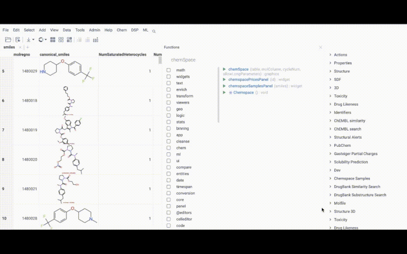

<!-- TITLE: Chem Space -->
<!-- SUBTITLE: -->

# Chem Space

Chemical Space is a feature to represent molecular dataset as a two dimensional map. Similarity of structures is used to calculate the distance on the map between the molecules so molecules with similar structure will be closely located on the map. Use this feature to visualize chemical dataset and identify its chemical classes.

See also:

  * [Chemical similarity](https://en.wikipedia.org/wiki/Chemical_similarity)
  * [Molecular fingerprints](fingerprints.md)
  * [Fingerprints - Screening and similarity](http://www.daylight.com/dayhtml/doc/theory/theory.finger.html)
  * [Stochastic Proximity Embedding](https://pdfs.semanticscholar.org/aeb7/aa3b9655838e00de12e33e64f9f1b43bb922.pdf)
